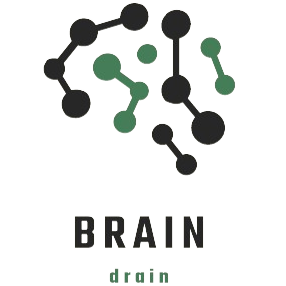

<h2 align="center">🧠 BRAIN DRAIN 🧠</h1>

 

<h1 align="left">📋 Description </h1>
  
Hello, we are Brain Drain!

 

<h1 align="left">Team Members 👨🏻‍💻</h1>
<table >
  <tr>
    <td align="center">Name</td>
    <td align="center">Role</td>
    <td align="center">Grade</td>
    <td align="center">Github</td>
  </tr>
  <tr>
    <td align="center"> Zhaklin Yankova</td>
    <td align="center">Scrum trainer</td>
    <td align="center">🟥 9B</td>
    <td align="center"> <a href="https://github.com/ZVYankova22">ZVYankova22 </a></td>
  </tr>
  <tr>
    <td align="center">Ivan Dimov</td>
    <td align="center">Backend developer</td>
    <td align="center">🟩 10V</td>
    <td align="center"> <a href="https://github.com/IDDimov21">IDDimov21 </a></td>
  </tr>
  <tr>
    <td align="center">Stiliyan Dimitrov</td>
    <td align="center">Backend developer</td>
    <td align="center">🟥 9B</td>
    <td align="center"> <a href="https://github.com/SKDimitrov22">SKDimitrov22 </a></td>
  </tr>
  <tr>
    <td align="center">Martin Velkov</td>
    <td align="center">Backend developer</td>
    <td align="center">🟩 10V</td>
    <td align="center"> <a href="https://github.com/MVVelkov21">MVVelkov21 </a></td>
  </tr>
    <tr>
    <td align="center">Aleksandar Ivanov</td>
    <td align="center">QA Engineer</td>
    <td align="center">🟥 9B</td>
    <td align="center"> <a href="https://github.com/ASIvanov22">ASIvanov22 </a></td>
  </tr>
  <tr>
    <td align="center">Ivaylo Dandarinov</td>
    <td align="center">Backend developer</td>
    <td align="center">🟩 10V</td>
    <td align="center"> <a href="https://github.com/IZDandarinov21">IZDandarinov21 </a></td>
  </tr>
</table>
 

<h1 align="center">📄 Documents</h1> 
  <ul>
    <li>Documentation</li>
    <li>Presentation</li>
    <li>QA Table</li>    
    <li>Test Plan</li>
  </ul>   
  
<h1 align="center">Used Technologies 🗂</h1>

   
   <a href="https://www.microsoft.com/en-us/microsoft-365/powerpoint">
   
   
   
   
   
   
  

<h1 align="center"> 🤓 Languages and Libraries</h1>

 
 
